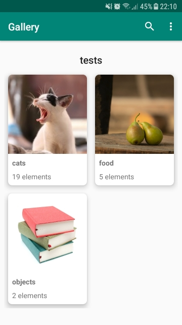
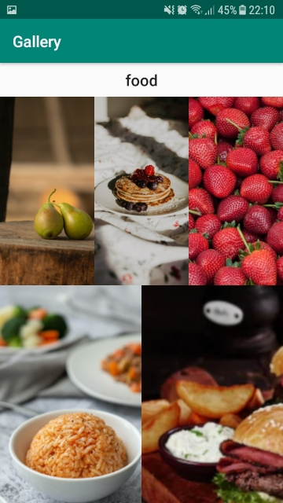

# Local Gallery

Visualize images and folders from your computer in your phone with Local Gallery.

The application consists of three screens, shown in the images and described below:

1. Main screen which shows the root folder name at the top and every folder inside the root folder, you can search by name and open configuration from this screen.
2. This screen shows the media contents inside a folder, click on any item to open full screen.
3. Media item in full screen, swipe up to show more details and the option to open the file in a browser.

# How to setup

Install this app in your Android phone and install the server-side program ([Source code and how to install]()) in your Windows machine.

Open your console command and run `ipconfig` command. It will show your IPv4 address e.g. 175.1.2.3

- Start the app, click the menu at the top left and select "Set server address"
- Put this url "http://(your-address)/api/" replace the parenthesis and text inside with your IPv4 address (e.g. `http://175.1.2.3/api/`)
- Tap Ok and you are good to go!